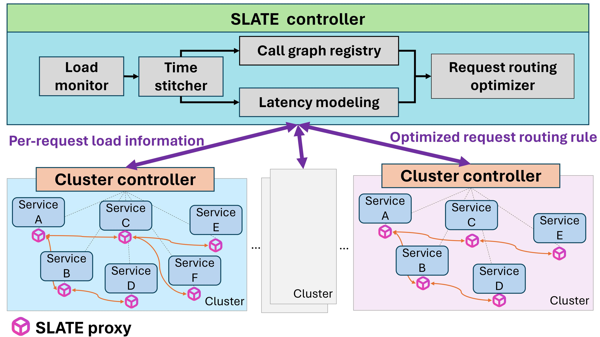

# [SLATE: Service Layer Traffic Engineering](https://servicelayernetworking.github.io/slate.html)

This repository houses all the components of *Service Layer Traffic Engineering (SLATE)*, a system that globally optimizes the flow of requests for end-to-end application latency and cost deployed in multi-region enviroments.

[*See the HotNets '24 Paper*](https://conferences.sigcomm.org/hotnets/2024/papers/hotnets24-107.pdf) 🚀🚀🚀🚀🚀


To find the multi-cluster survey results, go to ```multicluster survey result.pdf``` in the home directory of this repo.

There are three major components:
- Global controller: `/global-controller`
- Data plane: `/wasm-plugins/slate-plugin`
- Cluster controller: `/cluster-controller` (optional)



This system is tested on Istio.

The workflow is as such:
- The data plane in every region collects realtime metrics about current load (RPS) and experienced latency of those requests.
- The global controller builds a load to latency model for each service over time. When feasible, it uses this model in a Mixed-Integer Linear Program and solves for optimal request flow, minimizing latency. This solution is expressed as rules that are pushed to the data plane.
- The data plane enforces these rules.
